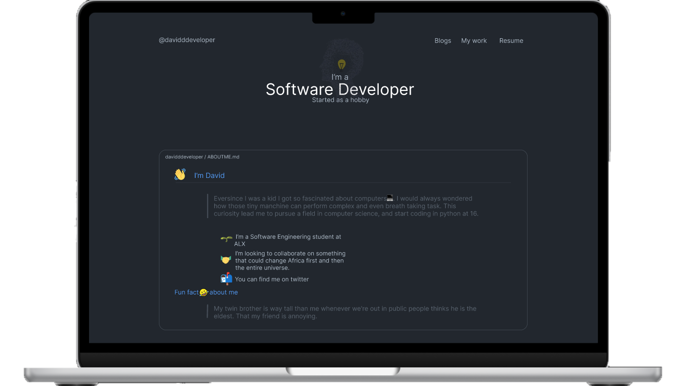

# My Website

## Inspiration
For the UI I was inspired of github profile Readme

For the theme I was also Inspired of github UI dark theme.

## Technologies
For the frontend I go with __React native__ and __tailwind__

For the backend I go with __Django__

I created an api two with django_rest_framework for my blogs.

__Overall__
    
    react 
    django 
    tailwind 
    apis

__tools__ 
    
    ckeditor, django_rest_framework, framermotion

## 
